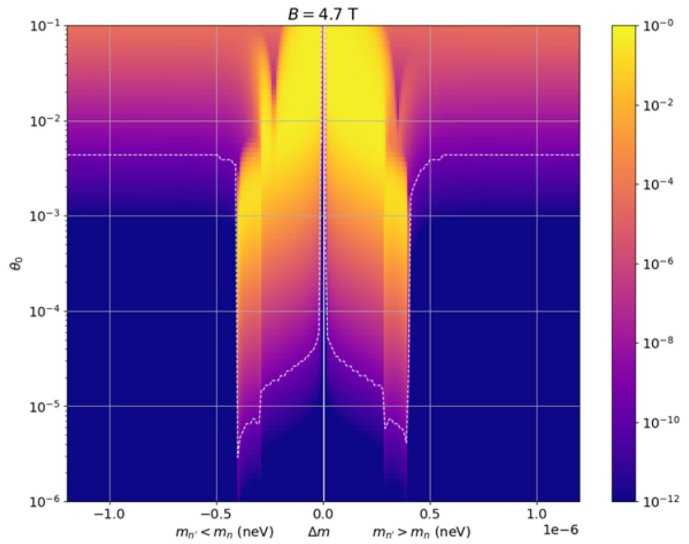

# gp-sans-run-analysis

Analysis of |B| variation during January 2024 nn' experiment at GP-SANS instrument, ORNL

## Table of Contents
1. Description   
	1.1 Background
	1.2 GP-SANS Analysis Scripts
2. Usage  
3. Author(s) and Acknowledgement  
4. References  

## 1 Description
This repository contains scripts that are 

### 1.1 Mirror Matter Search at HFIR 
<!-- Background -->
  
The figure above shows the simulated probability of neutron regeneration (color scale) as a function of possible $\delta m$ and mixing angle $\theta_0$ in the SNS 2020 nn' experiment [1] for a 4.7 T Magnetic Field.
The January 2024 nn' experiment at HFIR aims to continue this search, varying |B| to hopefully observe a different countrate, as this may suggest the existence of mirror matter [2].

Analysis of our experiment involves looking at the GP-SANS detector countrate within different Regions of Interest, and comparing those countrates across runs with different |B|. 
If a positive effect is observed for a particular |B|>0 vs |B|=0, this will be evidence for the possible existence of mirror matter.

### 1.2 GP-SANS Run Analysis Scripts 
Although the scripts in this repo are specific to the January 2024 mirror matter search at the GP-SANS beamline, an effort has been made to make them as generally applicable as possible.
Capabilities include: Run selection using criteria referenced in ONCAT summary, countrate within defined ROI analysis for preprocessed data files.

## 2 Usage
 1. Gather MNO files or McStas summaries of MNO files, store in `<data_dir>/MNO_files/`. Make sure to also have `DetIDmap.csv` and `ONCAT_summary_HFIR_CG2_IPTS-<ipts>.csv` in `<data_dir>` 
 2. Edit `settings.py` to specify relative paths (such as `<data_dir>`), and choose run selection criteria
 3. Run `analyze_B_runs.py`, and view output. On first run, MNO files will be analyzed which may take some time, but subsequent evaluations will be faster.

## 3 Authors and Acknowledgement
James M. Rogers, University of Tennessee - Knoxville  
contact: jroger87@vols.utk.edu  

This research used resources at the High Flux Isotope Reactor, a DoE Office of Science User Facility operated by the Oak Ridge National Laboratory.

## 4 References
[1] Gonzalez, Francisco M., Cary Rock, Leah J. Broussard, Lisa DeBeer-Schmitt, Matthew J. Frost, Lawrence Heilbronn, Erik B. Iverson, et al. “Improved Limits on n \rightarrow n’ Transformation from the Spallation Neutron Source,” 2024.  
[2] Z. Berezhiani, P. Ciarcelluti, D. Comelli, and F. L. Villante, International Journal of Modern Physics D 14, 107(2005), arXiv:0312605 [astro-ph]. 

## License  
Under the GNU AFFERO GENERAL PUBLIC LICENSE  

## Project Status  
Currently in progress as of 04-29-2024  
